# hse_hw1_meth
## Ссылка на google collab https://colab.research.google.com/drive/105SGUg03wBR-BIPyOaJHE51bCpVLVu7K?usp=sharing
## Число ридов, закартированных на участки
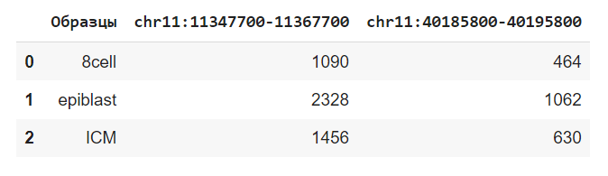
## Процент прочтений дуплицированно в каждом из образцов
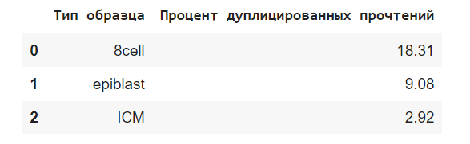
## Отчеты находятся в папке html 
## M-Bias
### 8-cell
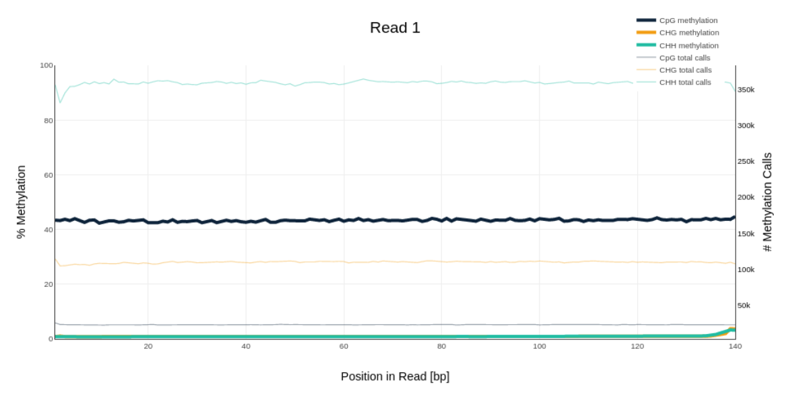
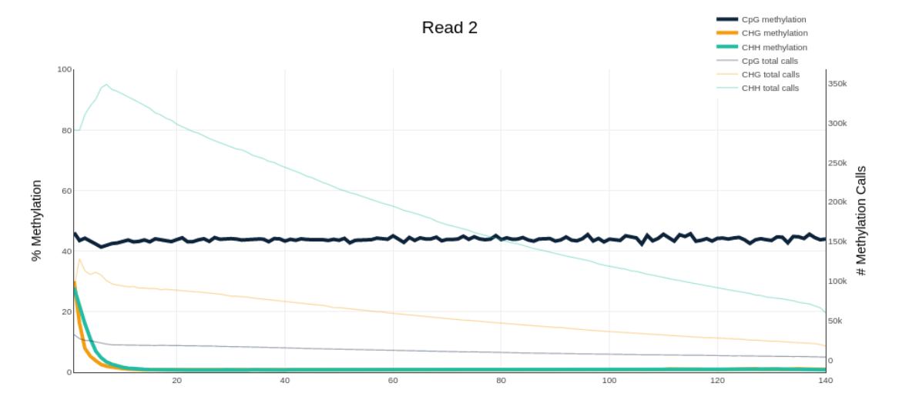
### Epiblast
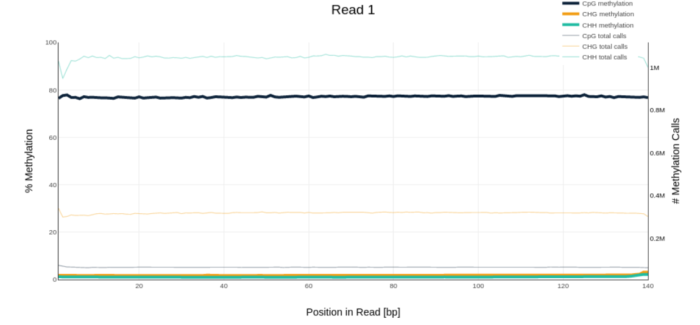
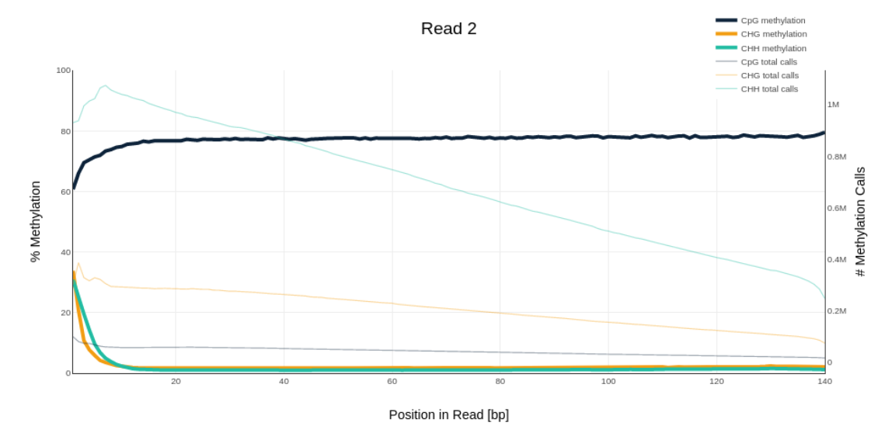
### ICM
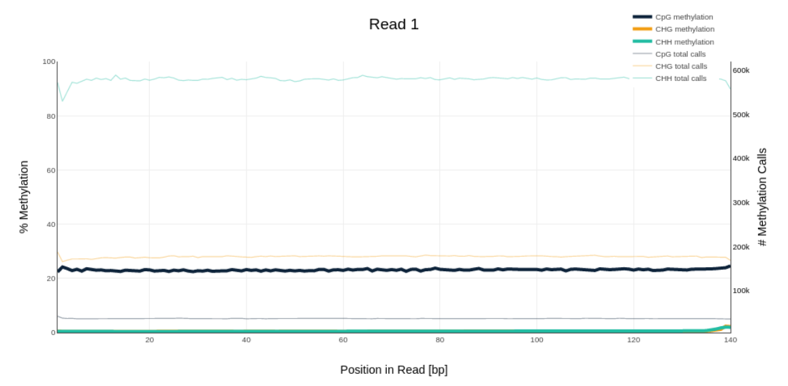
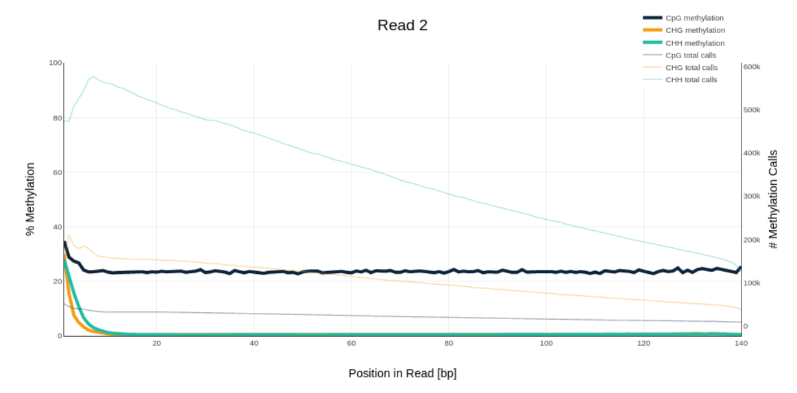
## Распределение метилирования
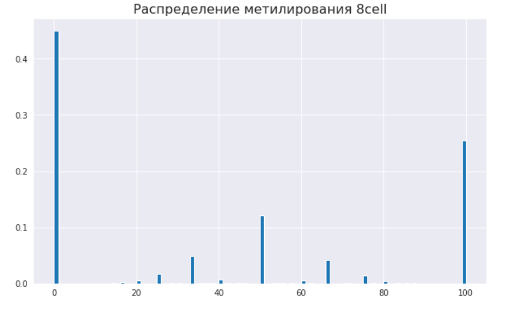
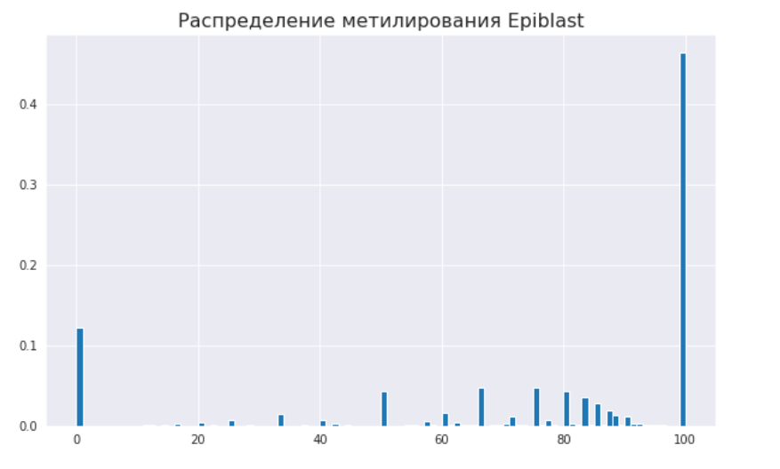
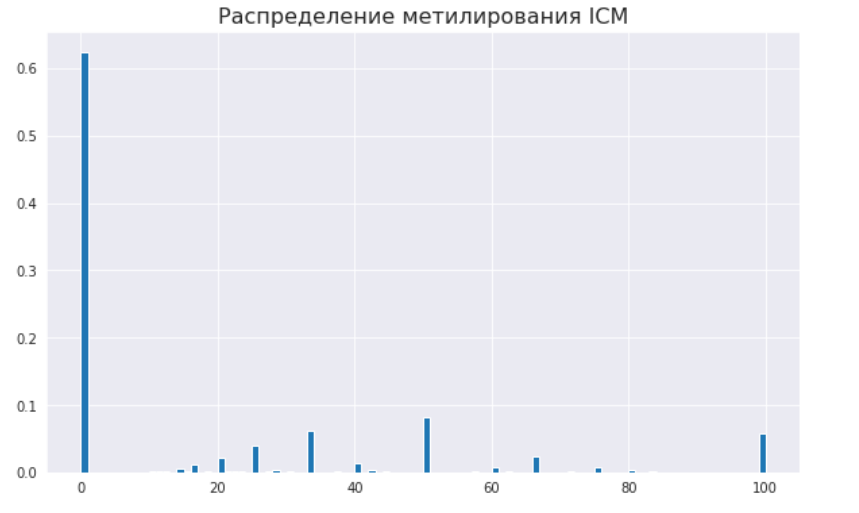
## Уровни метилирования
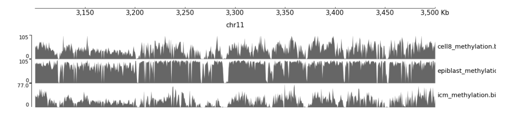
## Уровни покрытия
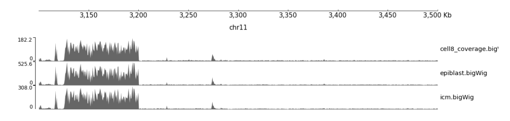
